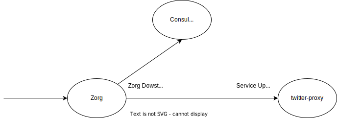

# Zorg Migration

[Link](https://zendesk.atlassian.net/wiki/spaces/PGM/pages/5413177080/Process+for+migrating+ZORG+upstreams+to+Istio+routing#Step-2%3A-verify-that-the-service-does-not-depend-on-the-Host-header) to wiki page.

## Procedure
1. Apply envoy filter `envoy-filter-host-header.yaml` to change `Host` header value to random string.
```shell
$ kubectl apply -f envoy-filter-host-header.yaml -n zis-actions-salesforce --context pod998
```
2. Apply envoy filter `access-log.yaml` to log the request. 
```shell
$ kubectl apply -f access-log.yaml -n zis-actions-salesforce --context pod998
```
3. Perform testing with service owner, if errors occurred then the application is using the `Host` header to extract the customer `subdomain`. This means service owner will need to make a change in their application code to extract host instead from either `X-Zendesk-Original-Host` or `x_forwarded_for` header which `zorg` will add once the call passes through. Use below command to monitor the logs.
```shell
# Get the label of the pods
$ kubectl -n <namespace> get po --show-labels --context <pod_name> 

$ kubectl -n zis-actions-salesforce get po --show-labels --context pod998

# Use a unique label to view the logs of istio-proxy
$ kubectl logs -l <choosen_label> -n <namespace> -c istio-proxy --context pod998 -f    

$ kubectl logs -l project=zis-actions-salesforce -n zis-actions-salesforce -c istio-proxy --context pod998 -f
```

## Traffic flow before and after

### Before 



### After


## Applying PR in atlantis

### Staging
1. At least 1 from network/edge and service owner approving the PR
2. comment `atlantis apply -p zorg-staging` and workflow will apply the changes in staging
